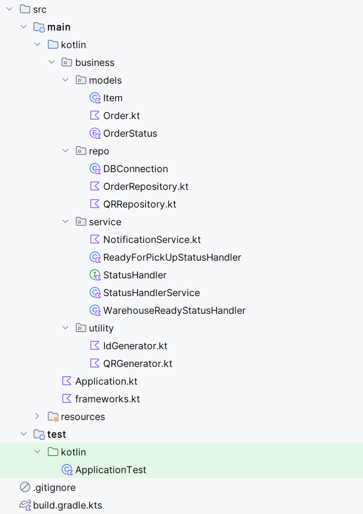
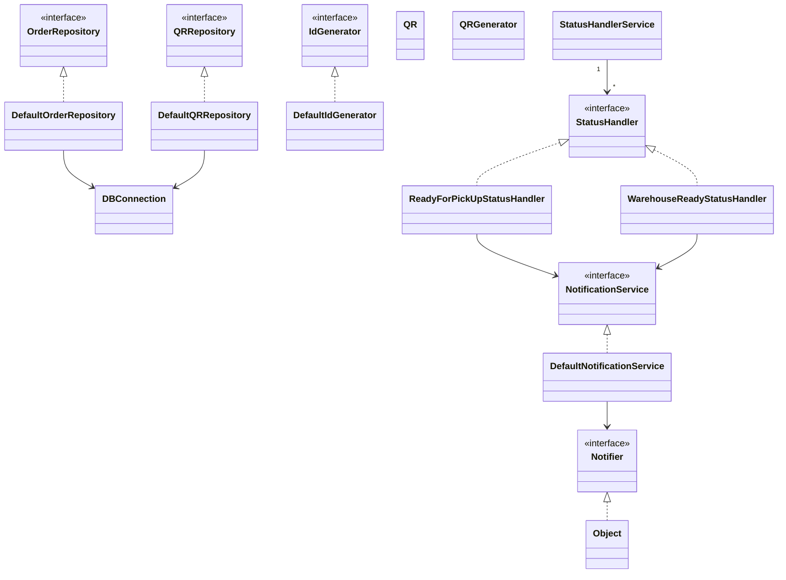

# Framework DI comparison

We'll have a look at the most popular options for dependency injection for Kotlin/Java frameworks:

- [Koin](./docs/Koin.md)
- [Dagger](./docs/Dagger.md)
- [Spring DI](./docs/SpringDI.md)

What will document cover:

- Injection patterns
- Scopes
- Lifecycles
- Compile / Runtime use
- Testing

Folder structure:

## Comparison

| Feature                       | Koin             | Quarkus + Spring DI     | Dagger                |
|-------------------------------|------------------|--------------------------|------------------------|
| Language                      | __Kotlin__      | Kotlin/Java              | Kotlin/__Java__            |
| Reflection                    | ⚠️ KClass        | ✅                       | ❌ |
| Code generation               | ❌                | ❌                       | ✅                     |
| DI Setup Style                | DSL              | Annotations (`@Service`) | Annotations + Modules + Component  |
| Test DI Override              | ✅ Easy           | ✅ via `@InjectMock`      | ⚠️ Manual modules      |
| Best for                      | Quick Kotlin apps| Spring-style microservices | Performance-critical systems |
| Native image support          | ✅ (via GraalVM)  | ✅ (Quarkus Native)       | ⚠️ (requires configuration) |
| Configuration          | Works OOTB  | Works OOTB       | Kapt is in maintanance, KSP is in Alpha |

---

## 🔍 TL;DR

- __Use Koin__ if you want simplicity and idiomatic Kotlin DSL.
- __Use Quarkus + Spring DI__ if you're building microservices with Spring familiarity and want Quarkus features.
- __Use Dagger__ if you want max performance, compile-time safety, or Android-like DI.
